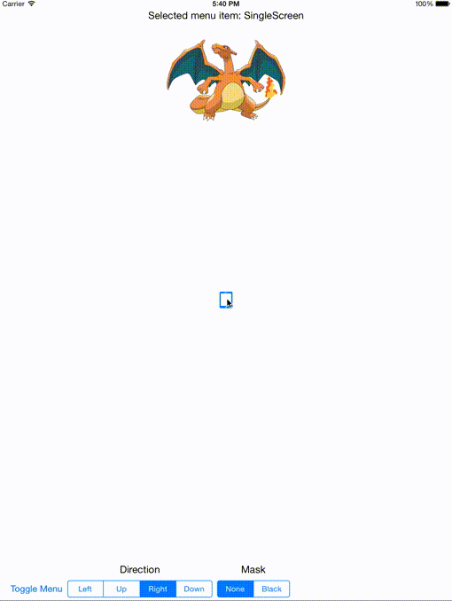

#E84PopOutMenu

Small UIControl for presenting a menu with any number of menu items with a nice open and close animation. Supports multiple directions, mask types, and configurable animation options.

## Installation

E84PopOutMenu is available through [CocoaPods](http://cocoapods.org). To install it, simply add the following to your Podfile:

    pod 'E84PopOutMenu'

You can also clone the repository and copy E84PopOutMenu/E84PopOutMenu.{h,m} into your project.

## Usage

The quickest way to see E84PopOutMenu in action is to clone the repository and run the Example project. This project allows you to play around with some of the options to test different ways of presenting menu items.

E84PopOutMenu is configured with reasonable defaults to make it work nicely right out of the box. The only thing you really need to do is add menu items, most likely in the `viewDidLoad` method of your view controller. Menu items are added by calling:

    - (void)addPopOutMenuItem:(UIView *)menuItem forIdentifier:(NSString *)identifier;

on your E84PopOutMenu. Menu items are shown in the order they are added.

To listen for changes in the selected menu item, add an IBAction for the `UIControlEventValueChanged` control event of your menu.

## Author

Paul Pilone, <paul@element84.com>

Element 84, <http://www.element84.com>

## License

E84PopOutMenu is available under the MIT license. See the LICENSE file for more info.
